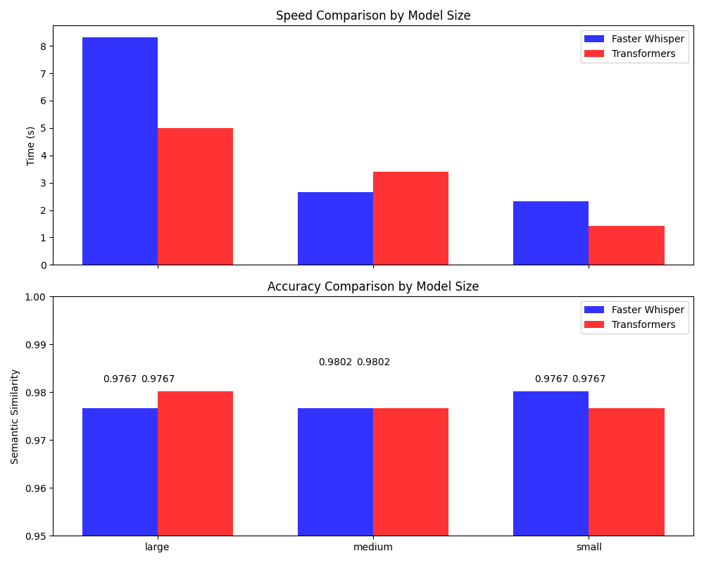

# Distil-Whisper Speech Recognition Models Comparison on MacBook

## Overview
I wanted to see which models run faster and more accurate, the transformers with mps backend or ctranslate2 implementation of faster-whisper. The comparison focuses on two key metrics: speed (time taken for transcription) and accuracy (semantic similarity to the ground truth).

## Datasets
The models were benchmarked using the `librispeech_asr_dummy` dataset, which serves as a stand-in for the full LibriSpeech dataset used in ASR research. The dummy dataset contains a smaller subset of the original dataset for faster processing during testing.

## Models
Three different sizes of models were compared from each family:
- Large
- Medium
- Small

For the Faster Whisper family, the models used were:
- `distil-large-v2`
- `distil-medium.en`
- `distil-small.en`

For the Transformers, the models were accessed through the Hugging Face's Transformers library using the same identifiers.

## Metrics
Two benchmarks were used to evaluate the models:
- Speed: The time taken by the model to transcribe an audio sample from the dataset.
- Accuracy: The semantic similarity between the transcription produced by the model and the ground truth, computed using cosine similarity of sentence embeddings.

## Results
The results showed that:
- For the large and medium models, Faster Whisper had a slight edge in speed over the Transformers, while maintaining comparable accuracy.
- For the small models, the speed was nearly identical, but the Faster Whisper model again showed a marginally higher semantic similarity score.

## Conclusion
Across all model sizes, Faster Whisper and Transformers demonstrated highly competitive performance. Faster Whisper models were generally faster, suggesting an efficiency benefit, particularly for the larger model sizes, without compromising on the semantic accuracy of the transcriptions.

For applications where transcription speed is critical, Faster Whisper models may offer the best balance of speed and accuracy. However, for scenarios where model footprint and resource constraints are a concern, the small models from both families provide an excellent trade-off.

Let's wait for ctranslate2 mps implementation

